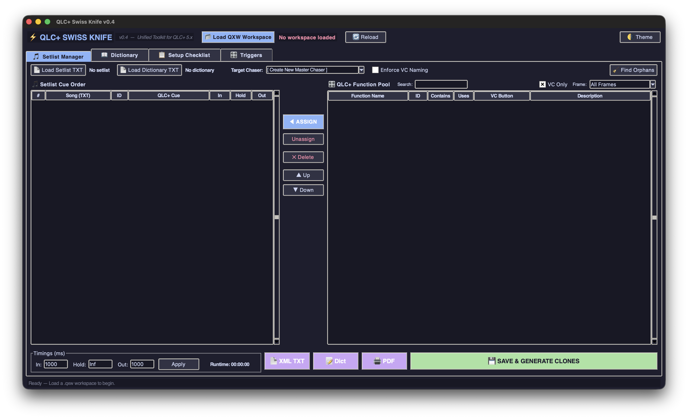
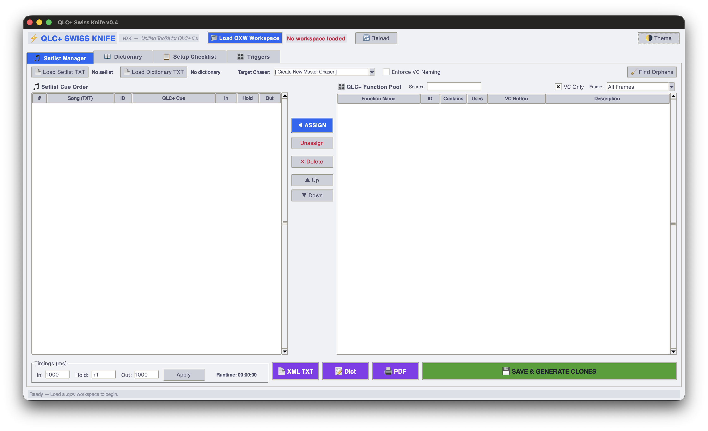

# ⚡ QLC+ Swiss Knife

**A unified, ergonomic toolkit for QLC+ 5.x — pure Python, zero external dependencies.**

> ⚠️ **Independent Project Notice**
> This project is **not affiliated with, endorsed by, or officially connected to the QLC+ project or its development team** in any way. All credit for QLC+ itself goes to the [QLC+ team](https://www.qlcplus.org/). This script is an independent community utility that works *on top of* QLC+ workspace files (`.qxw`).

---

## Screenshots

| Dark Theme | Light Theme |
|:---:|:---:|
|  |  |

---

## What is it?

QLC+ Swiss Knife is a single-file Python 3 desktop application that brings five essential live-production utilities together under one roof. Instead of juggling separate scripts or manual XML editing, you get a clean tabbed interface that reads your `.qxw` workspace and lets you manage it visually.

It runs on **Windows, macOS, and Linux** with nothing more than a standard Python 3 installation (tkinter included).

---

## Features

### 🎵 Setlist Manager
Build complete show cue lists from a plain-text setlist. The **multi-slot architecture** gives each QLC+ CueList its own tab — manage an entire show with multiple cue lists in a single session. Map songs to QLC+ functions, generate pristine cloned cue sequences, rename Chasers to match their CueList caption, and export per-slot **PDFs** — all without touching the XML by hand.

### 📖 Dictionary Manager
Create and maintain `ID → description` mapping files that annotate your QLC+ function pool with human-readable labels. Shared across all tabs so your annotations stay consistent throughout the session.

### 📋 Setup Checklist
Parse fixture patches, 3D stage positions, groups, and universe assignments directly from the workspace. Export **printable blueprint PDFs** and text checklists — ideal for pre-show setup or handing off to crew.

### 🎛 Trigger Manager
Audit and edit all **Virtual Console keyboard and MIDI bindings** in a spreadsheet-style table. Correctly resolves nested VC frame ancestry so the Frame filter works at any nesting depth. Spot conflicts, fix missing assignments, and write changes back to the workspace.

### 🔧 Fixture Configurator
Design your stage rig from scratch. Load `.qxf` fixture definitions, add instances to a rig table, and **drag them on a 2D top-down canvas** to set positions. Configure stage dimensions, auto-assign DMX addresses, then load a `.qxw` template and **generate a ready-to-use workspace** with all fixture blocks and 3D monitor positions populated from your canvas layout. An intelligent **Function Assignment Panel** auto-maps template functions to rig fixtures using name-role matching and spatial proximity.

---

## Requirements

| Requirement | Version |
|---|---|
| Python | 3.8 or newer |
| tkinter | Included with standard Python |
| QLC+ workspace | `.qxw` format (QLC+ 5.x) |

No `pip install` needed. No virtual environment required.

---

## Quick Start

```bash
# Clone the repository
git clone https://github.com/giopas/qlc-plus-swiss-knife-tool-script.git
cd qlc-plus-swiss-knife-tool-script

# Run the app
python3 qlc_swiss_knife_0.7.py
```

On **Windows** you can also double-click the `.py` file if Python is associated with `.py` files in your system.

1. Click **📂 Load QXW Workspace** and open your `.qxw` file.
2. Switch between tabs to access each tool.
3. Changes can be saved back to the workspace directly from each tab.

---

## Supported Platforms

| Platform | Status |
|---|---|
| Windows 10/11 | ✅ Tested |
| macOS (12+) | ✅ Tested |
| Linux (Ubuntu/Debian) | ✅ Tested |

---

## Changelog

See [CHANGELOG.md](CHANGELOG.md) for a full history of changes across all versions.

---

## Contributing

Bug reports, feature suggestions, and pull requests are warmly welcome!
Please read [CONTRIBUTING.md](CONTRIBUTING.md) before opening an issue or submitting code.

---

## Roadmap

See [ROADMAP.md](ROADMAP.md) for planned features and future directions.

---

## License

This project is released under the **MIT License** — see [LICENSE](LICENSE) for the full text.
In short: free to use, modify, and distribute. Attribution appreciated. No warranties provided.

---

## Acknowledgements

All credit for **QLC+** — the lighting control software this tool is built around — belongs to the [QLC+ development team](https://github.com/mcallegari/qlcplus). This script is an independent community contribution and is not part of the official QLC+ project.
