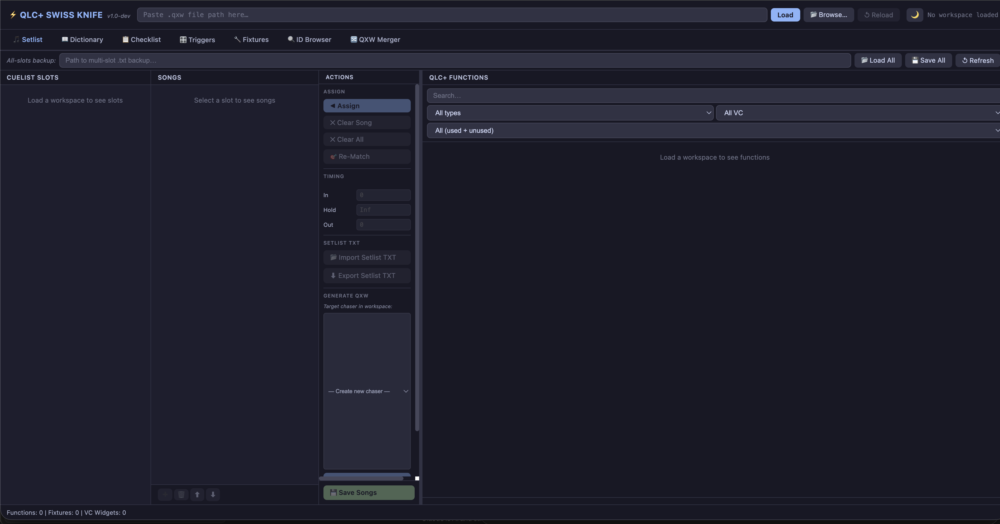
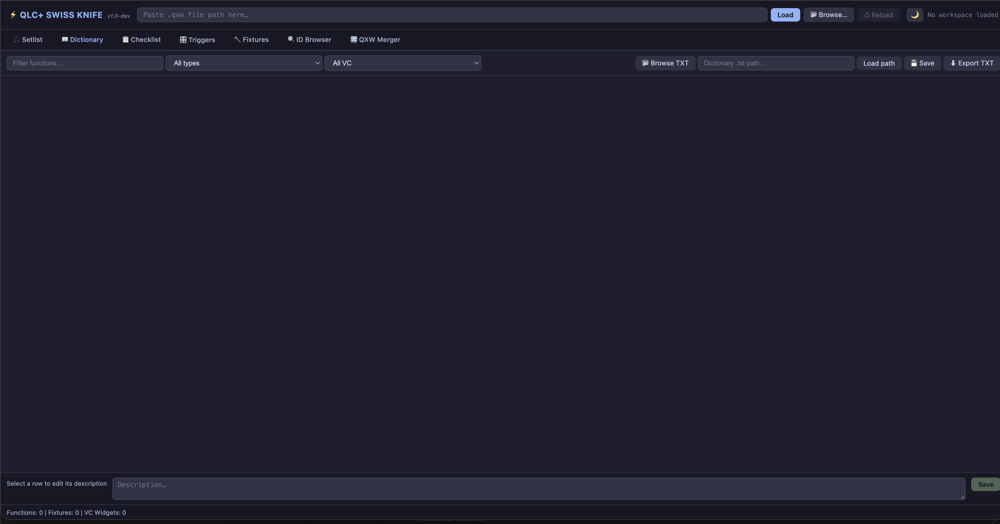
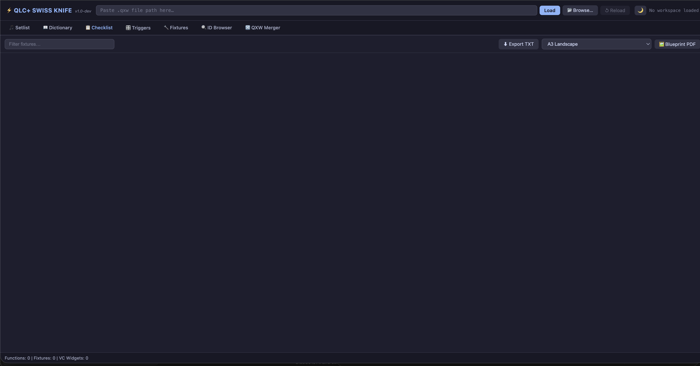
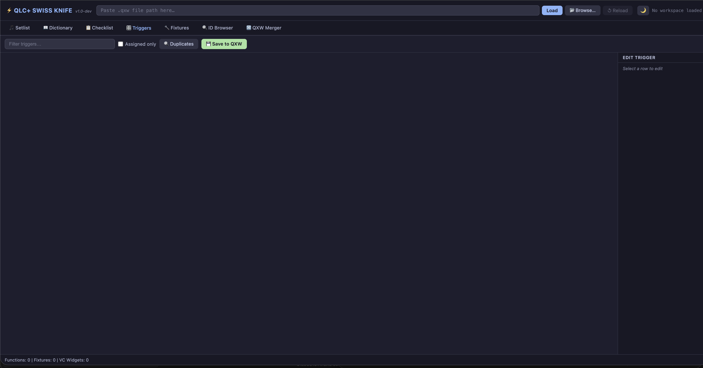
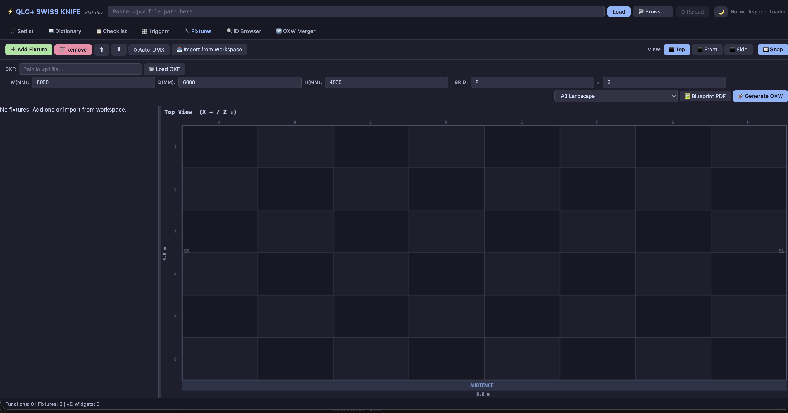
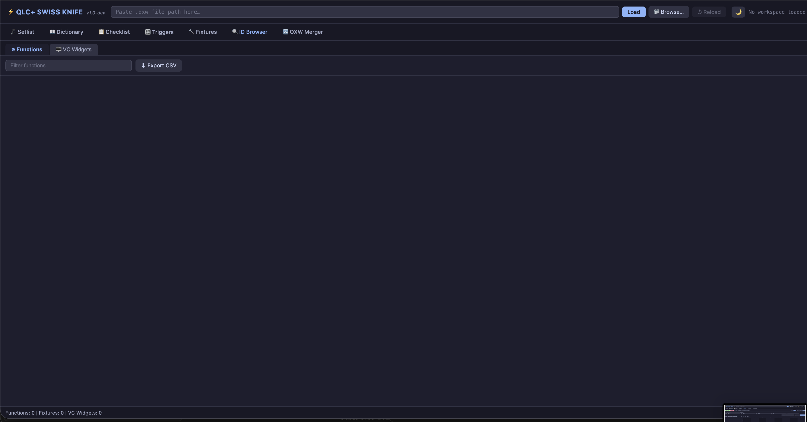
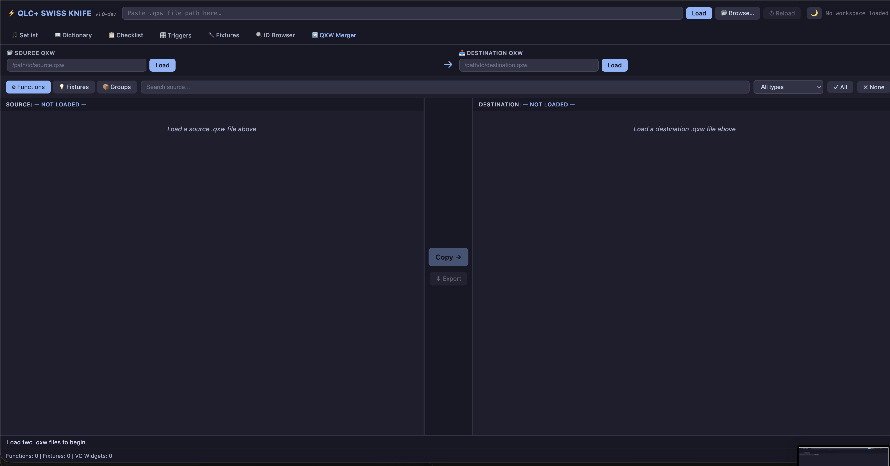

# ⚡ QLC+ Swiss Knife — v1.0

**A web-based toolkit for QLC+ 5.x — load your `.qxw` workspace in a browser and manage every aspect of your show from a clean, tabbed interface.**

> ⚠️ **Independent Project Notice**
> This project is **not affiliated with, endorsed by, or officially connected to the QLC+ project or its development team** in any way. All credit for QLC+ itself goes to the [QLC+ team](https://www.qlcplus.org/). This is an independent community utility that works *on top of* QLC+ workspace files (`.qxw`).

---

## What's new in v1.0

v1.0 is a **full rewrite** from a Tkinter desktop app to a **Flask web application** that runs locally and opens in your browser. All seven tabs are fully ported, and two major new features are added:

- **🔀 QXW Merger** — load two `.qxw` files side by side and copy fixtures, groups, and functions from one into the other with automatic ID remapping, then export the merged workspace.
- **Security hardening** — CSRF origin check, Content-Security-Policy header, file-extension whitelist on upload, sanitised error messages.
- **Native OS Save dialog** (`showSaveFilePicker`) for QXW generation — no more output-directory input box.

---

## Screenshots

### v1.0 — Web UI *(actively developed)*

| 🎵 Setlist Manager | 📖 Dictionary |
|:---:|:---:|
|  |  |

| 📋 Setup Checklist | 🎛 Triggers |
|:---:|:---:|
|  |  |

| 🔧 Fixture Configurator | 🔍 ID Browser |
|:---:|:---:|
|  |  |

| 🔀 QXW Merger *(new in v1.0)* | |
|:---:|:---:|
|  | |

---

### v0.7.3 — Desktop UI (Tkinter) *(no longer developed)*

> The original desktop application required no external dependencies beyond Python + tkinter.
> It is preserved in the repository for reference but will not receive further updates.
> All future development continues on the v1.0 web UI above.

| 🎵 Setlist Manager | 📖 Dictionary |
|:---:|:---:|
|  |  |

| 📋 Setup Checklist | 🎛 Triggers |
|:---:|:---:|
|  |  |

| 🔧 Fixture Configurator | 🔍 ID Browser |
|:---:|:---:|
|  |  |

---

## Features

### 🎵 Setlist Manager
Build complete show cue lists from a plain-text setlist. The **multi-slot architecture** gives each QLC+ CueList its own tab. Map songs to QLC+ functions with a four-stage fuzzy matcher (exact → substring → token → fuzzy), generate pristine cloned cue sequences, and export per-slot **PDFs** — all without touching the XML by hand. A **function pool panel** shows usage counts, ✦ marks for already-generated clones, and Used/Unused filtering.

### 📖 Dictionary Manager
Create and maintain `ID → description` mapping files that annotate your QLC+ function pool with human-readable labels. Load/save `.txt` dictionaries, edit descriptions inline, and browse Virtual Console widgets alongside functions.

### 📋 Setup Checklist
Parse fixture patches, 3D stage positions, groups, and universe assignments directly from the workspace. Export **printable blueprint PDFs** (top-down + front view) and TXT checklists — ideal for pre-show setup or handing off to crew.

### 🎛 Trigger Manager
Audit and edit all **Virtual Console keyboard and MIDI bindings** in a spreadsheet-style table. Resolves nested VC frame ancestry so the Frame filter works at any nesting depth. Spot conflicts, fix missing assignments, and write changes back to the workspace.

### 🔧 Fixture Configurator
Design your stage rig from scratch. Load `.qxf` fixture definitions, add instances to a rig table, and **drag them on a 2D top-down canvas**. Configure stage dimensions, auto-assign DMX addresses, then generate a ready-to-use workspace with all fixture blocks and 3D monitor positions populated from your canvas layout.

### 🔍 ID Browser
Inspect every function and Virtual Console widget. Live filtering, click-to-sort column headers, **Export CSV**, and **Export PDF** with configurable paper/font-size — for both the Functions and VC Widgets sub-tabs.

### 🔀 QXW Merger *(new in v1.0)*
Load any two `.qxw` files independently of the main workspace. Browse **Fixtures**, **Fixture Groups**, and **Functions** (filterable by type and name) from the source. Tick what you want, click **Copy →**, and the selected elements are inserted into the destination with IDs remapped above the destination's highest existing ID. Name-clash warnings appear inline. Export the merged result via the native OS Save dialog.

---

## Requirements

| Requirement | Details |
|---|---|
| Python | 3.8 or newer |
| Flask | `pip install flask` — the only external dependency |
| Browser | Chrome or Edge recommended (for native Save dialog); Firefox/Safari also work |
| QLC+ workspace | `.qxw` format (QLC+ 5.x) |

---

## Quick Start

### macOS / Linux — first time only

```bash
git clone https://github.com/giopas/qlc-plus-swiss-knife-tool-script.git
cd qlc-plus-swiss-knife-tool-script
python3 -m venv .venv
source .venv/bin/activate
pip install flask
python3 app.py
```

### macOS / Linux — every subsequent run

```bash
cd qlc-plus-swiss-knife-tool-script
python3 app.py
```

> The launcher detects the `.venv` automatically — no need to activate it manually after the first setup.

---

### Windows (Command Prompt) — first time only

```bat
git clone https://github.com/giopas/qlc-plus-swiss-knife-tool-script.git
cd qlc-plus-swiss-knife-tool-script
python -m venv .venv
.venv\Scripts\activate.bat
pip install flask
python app.py
```

### Windows (Command Prompt) — every subsequent run

```bat
cd qlc-plus-swiss-knife-tool-script
python app.py
```

---

The app opens `http://localhost:5731` automatically. Press **Ctrl+C** to quit.

### Loading a workspace

- **Path mode** — paste the full path to your `.qxw` file in the header bar and click **Load**. Use **↺ Reload** to re-parse from disk at any time.
- **Upload mode** — click **📂 Browse…** or drag a `.qxw` file anywhere onto the window.

---

## Supported Platforms

| Platform | Status |
|---|---|
| Windows 10/11 | ✅ Tested |
| macOS 12+ | ✅ Tested |
| Linux (Ubuntu / Debian) | ✅ Tested |

---

## Security

The app binds **only to `127.0.0.1`** (localhost) and is not accessible from other machines on your network. Additional hardening:

- All state-changing API requests are validated against a localhost Origin header (CSRF protection).
- File uploads are restricted to `.qxw` extension only.
- `Content-Security-Policy`, `X-Frame-Options`, `X-Content-Type-Options`, and `Referrer-Policy` headers are set on every response.
- Exception messages sent to the browser have filesystem paths stripped.

---

## Project Structure

```
app.py                   ← Flask entry point (auto-bootstraps venv)
core/
  workspace.py           ← QXW parser, function pool, setlist engine
  merger.py              ← Independent two-file merger (new in v1.0)
  fixture.py             ← Rig state, QXF parsing, DMX auto-assign
  pdf.py                 ← Pure-Python PDF builder (no reportlab)
routes/
  workspace_routes.py    ← /api/load, /api/status, /api/reload
  setlist_routes.py      ← /api/setlist/*
  merger_routes.py       ← /api/merger/*  (new in v1.0)
  dictionary_routes.py   ← /api/dictionary/*
  checklist_routes.py    ← /api/checklist/*
  triggers_routes.py     ← /api/triggers/*
  fixture_routes.py      ← /api/fixture/*
  id_browser_routes.py   ← /api/functions, /api/vc-widgets
static/
  js/                    ← Per-tab JavaScript modules
  css/style.css          ← Catppuccin theme (Dark / Grey / Light)
templates/index.html     ← Single-page application shell
```

---

## Changelog

See [CHANGELOG.md](CHANGELOG.md) for a full history of changes across all versions.

---

## Contributing

Bug reports, feature suggestions, and pull requests are warmly welcome!
Please read [CONTRIBUTING.md](CONTRIBUTING.md) before opening an issue or submitting code.

---

## Roadmap

See [ROADMAP.md](ROADMAP.md) for planned features and future directions.

---

## License

This project is released under the **MIT License** — see [LICENSE](LICENSE) for the full text.
In short: free to use, modify, and distribute. Attribution appreciated. No warranties provided.

---

## Acknowledgements

All credit for **QLC+** — the lighting control software this tool is built around — belongs to the [QLC+ development team](https://github.com/mcallegari/qlcplus). This script is an independent community contribution and is not part of the official QLC+ project.
