# ⚡ QLC+ Swiss Knife — v1.2.0

**A web-based toolkit for QLC+ 5.x — load your `.qxw` workspace in a browser (or a native window) and manage every aspect of your show from a clean, sidebar-driven interface.**

> ⚠️ **Independent Project Notice**
> This project is **not affiliated with, endorsed by, or officially connected to the QLC+ project or its development team** in any way. All credit for QLC+ itself goes to the [QLC+ team](https://www.qlcplus.org/). This is an independent community utility that works *on top of* QLC+ workspace files (`.qxw`).

---

## ⚗️ Early release — bugs expected

This tool is in active development. Some features may be incomplete, behave unexpectedly, or not yet work at all. **Please test it and report any issues on the [Issues page](https://github.com/giopas/qlc-plus-swiss-knife-tool-script/issues)** — every bug report helps.

**Your show files are safe to experiment with:**
All generated outputs (new QXW workspaces, PDFs, CSVs) are saved to a *new file* via a Save dialog — your original `.qxw` is never overwritten. The one intentional exception is the **Trigger Manager "Save to loaded QXW"** button, which writes keyboard/MIDI bindings back to the file you loaded by path — exactly as described on that page. A "Save as new file…" option is also available for Triggers.

---

## What's new in v1.2.0

### ⚡ Quick Start QXW Generator *(Alpha)*

Create production-ready QLC+ workspaces in minutes, even with zero QLC+ experience. A 5-step wizard walks you through fixture selection, stage placement, automatic capability analysis, and intelligent VC layout generation — time to running show: ~5 minutes.

### 🎭 Show Info, Tech Rider & Setlist Enhancements

- **Show name & event date** on the Start screen, saved in sessions — used for PDF headers and export filenames
- **Tech Rider Generator** tab with grouped fixture summary and PDF export
- **Setlist multi-export** with combined PDF across slots and clone cue name resolution

### 🛡️ Security Hardening

QXF file size cap, Content-Disposition filename quoting, and expanded security documentation.

---

## Screenshots

| | | |
|---|---|---|
| 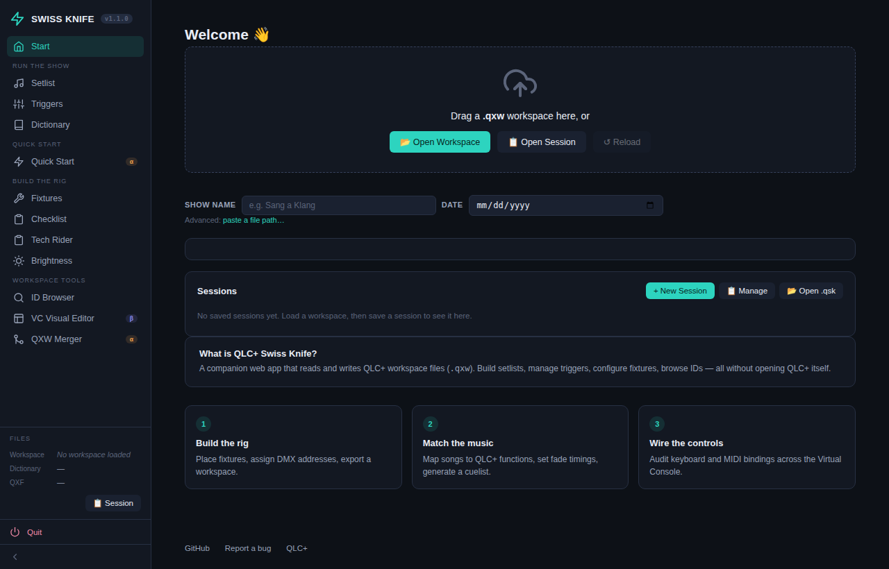 | 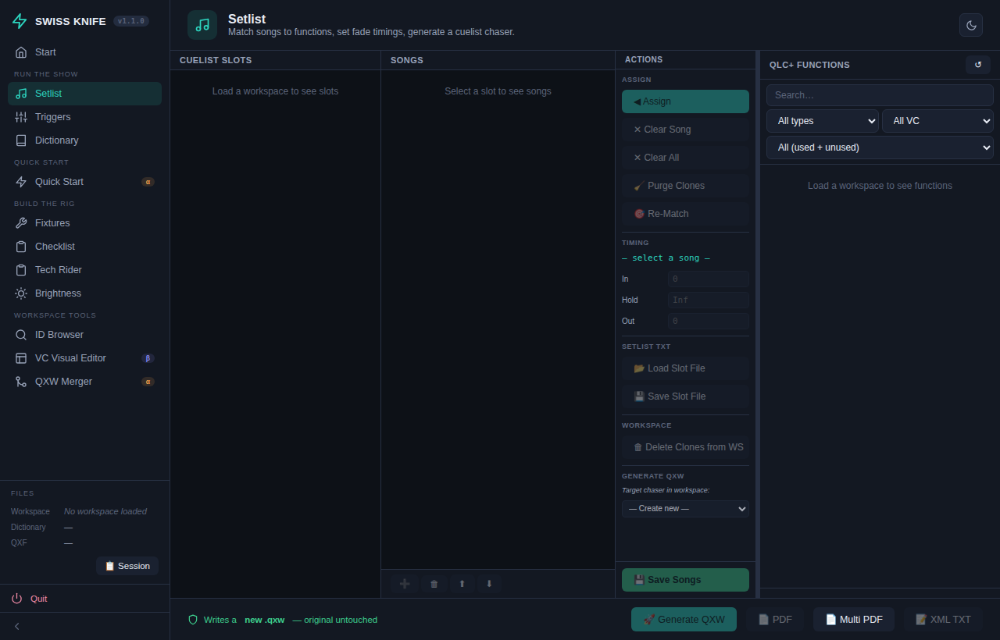 | 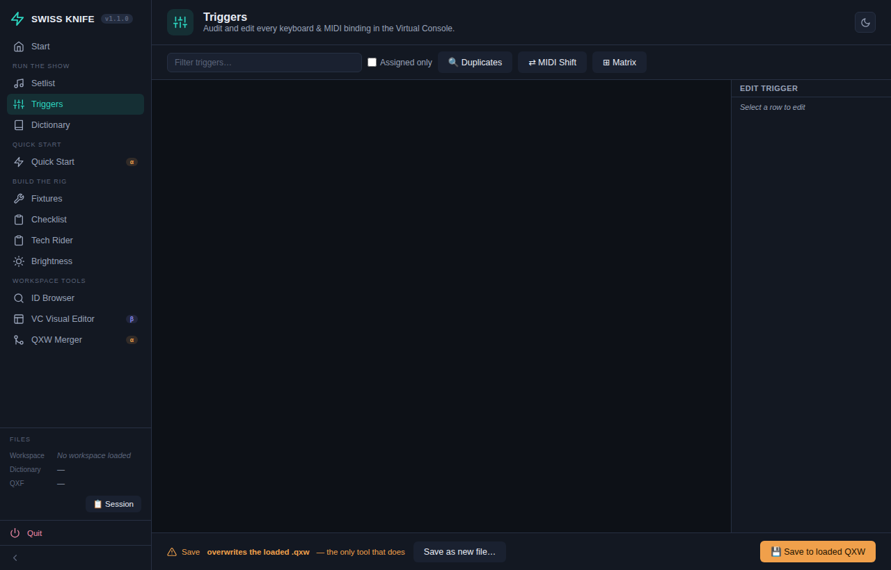 |
| Start Screen | Setlist Manager | Trigger Manager |
| 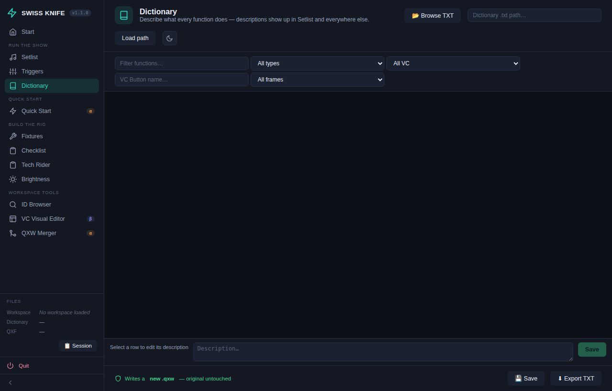 | 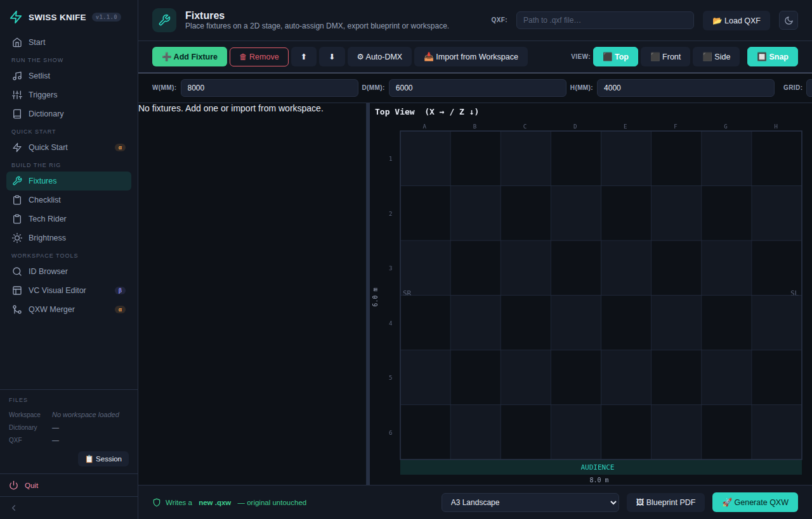 | 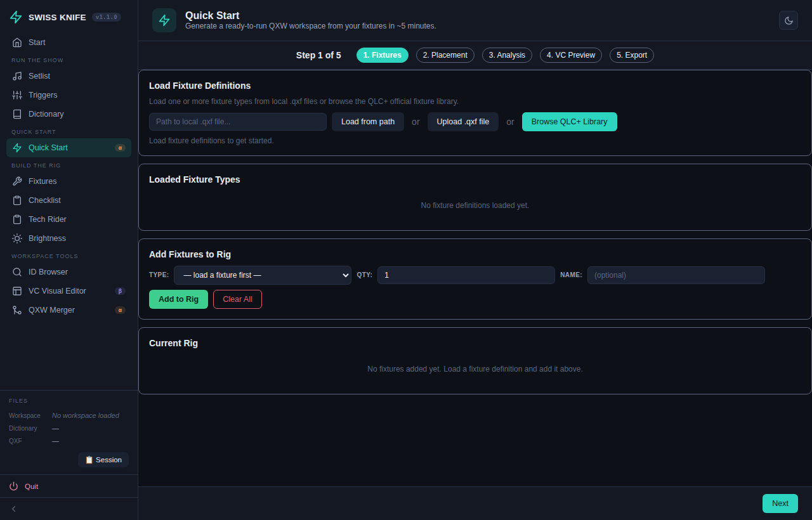 |
| Dictionary | Fixture Configurator | Quick Start *(Alpha)* |
| 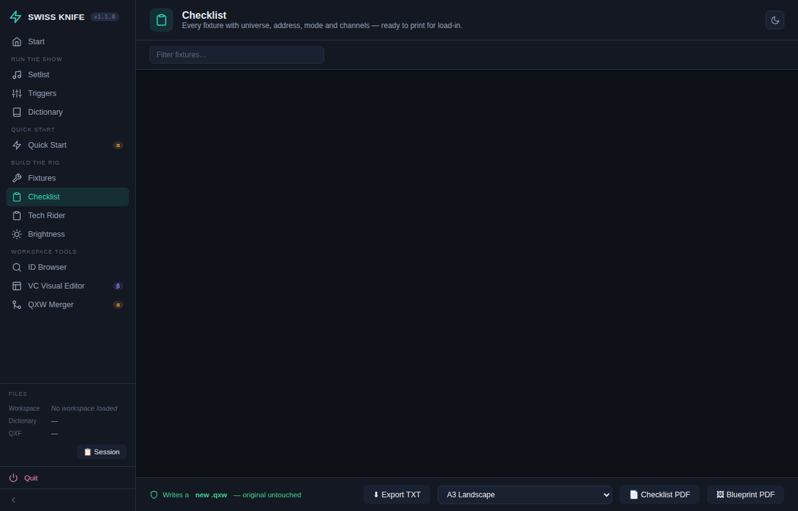 | 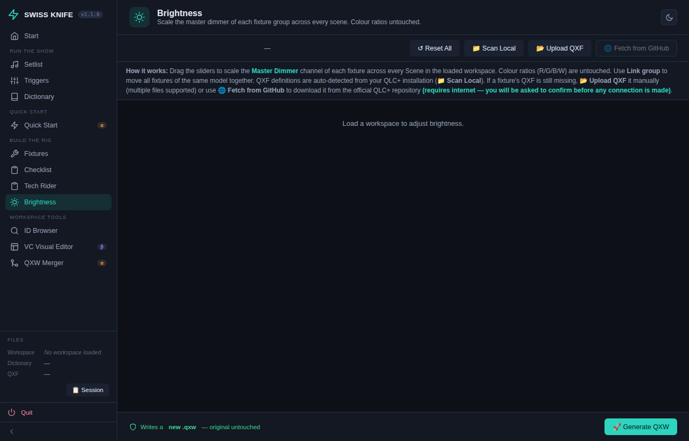 | 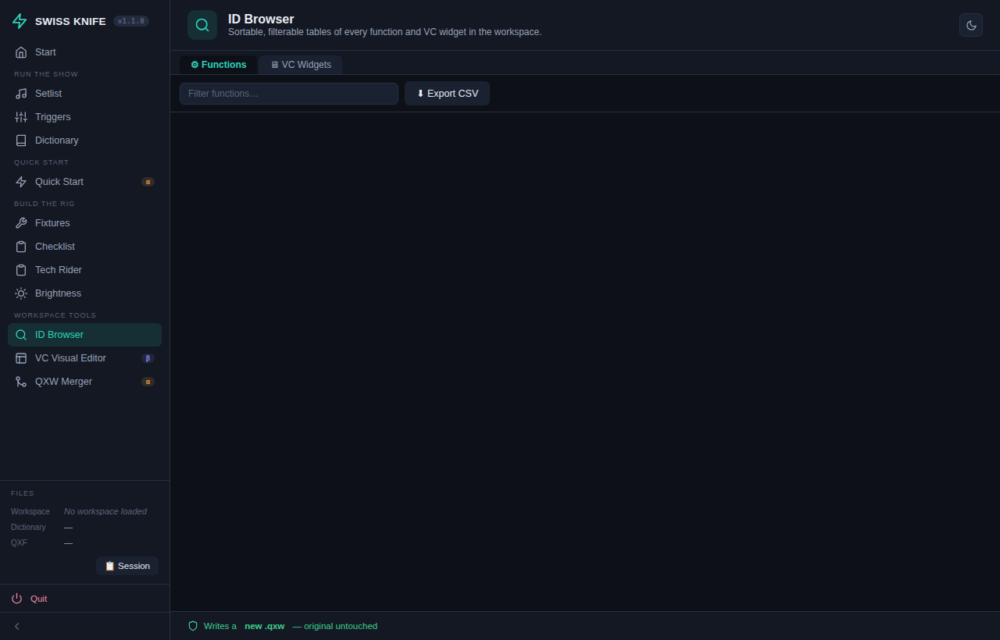 |
| Setup Checklist | Brightness | ID Browser |
| 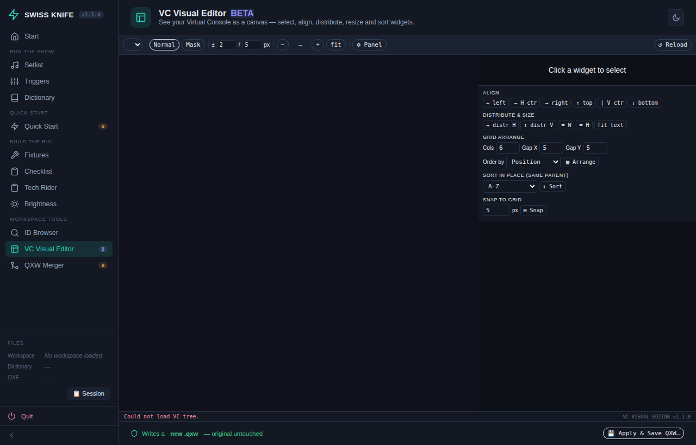 | 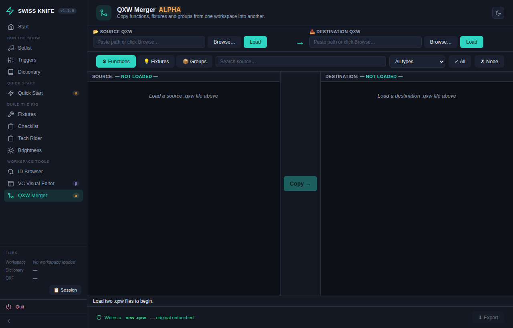 | 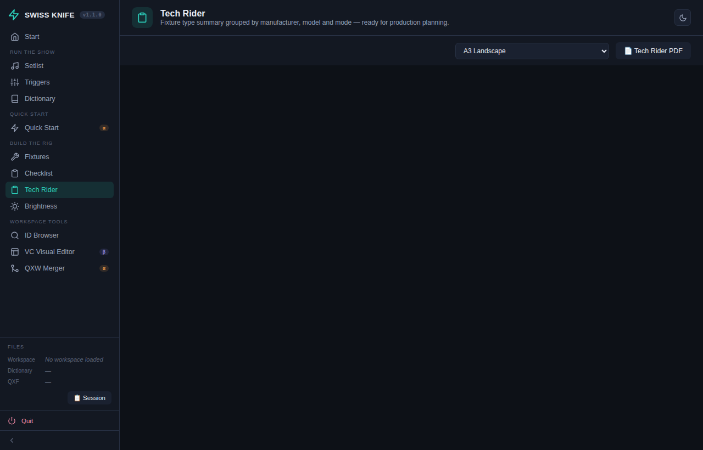 |
| VC Visual Editor *(Beta)* | QXW Merger *(Alpha)* | Tech Rider |

---

## Features

### Setlist Manager
Build complete show cue lists from a plain-text setlist. The **multi-slot architecture** gives each QLC+ CueList its own tab. Map songs to QLC+ functions with a four-stage fuzzy matcher (exact → substring → token → fuzzy), generate pristine cloned cue sequences, and export per-slot **PDFs** — all without touching the XML by hand.

The **function pool panel** shows usage counts, ✦ marks for already-generated clones, Used/Unused filtering, inline descriptions, and a refresh button to pull the latest descriptions from the Dictionary. Assigned songs display the matched function name, its VC button caption, and its description inline.

### Triggers
Audit and edit all **Virtual Console keyboard and MIDI bindings** in a spreadsheet-style table. Resolves nested VC frame ancestry so the Frame filter works at any nesting depth. Spot conflicts, fix missing assignments, and write changes back to the workspace. Additional tools: **Duplicates** highlights conflicting rows inline; **MIDI Shift** bulk-reassigns all triggers from one MIDI address to another; **Matrix** toggles an assignment grid showing every widget vs. every key, with duplicate keys flagged.

### Dictionary
Create and maintain `ID → description` mapping files that annotate your QLC+ function pool with human-readable labels. Load/save `.txt` dictionaries, edit descriptions inline, and filter by function type, VC button presence, **VC button name**, and **VC frame** (dropdown auto-populated from all frames in the workspace, with nested ancestry support).

### Fixtures
Design your stage rig from scratch. Load `.qxf` fixture definitions, add instances to a rig table, and **drag them on a 2D top-down canvas**. Configure stage dimensions, auto-assign DMX addresses, then generate a ready-to-use workspace with all fixture blocks and 3D monitor positions populated from your canvas layout. Export **blueprint PDFs** in multiple paper sizes.

### Quick Start QXW Generator *(Alpha)*
Create production-ready QLC+ workspaces in minutes, even with zero QLC+ experience. A 5-step wizard walks you through fixture selection, stage placement, automatic capability analysis, and intelligent VC layout generation. The system detects RGB, strobe, pan/tilt, and dimmer channels, groups fixtures by type, and auto-generates macro buttons (ALL ON/OFF, BLACKOUT), fixture group selectors, pre-configured scenes (Warm White, Cold White, Colors), skeleton effect chasers (Dimmer Sweep, Color Fade, Strobe), and four custom slots ready for your own scenes. Export a complete, wired `.qxw` file and open it in QLC+ — time to running show: ~5 minutes.

> **Internet access note:** The "Browse QLC+ Library" button in Step 1 fetches fixture definitions from the [official QLC+ fixture repository on GitHub](https://github.com/mcallegari/qlcplus/tree/master/resources/fixtures). This is the **only feature** in the app that makes external network calls. All other operations — loading, editing, exporting — are fully local with no internet required. If you prefer to stay offline, load fixture definitions from local `.qxf` files instead.

### Checklist
Parse fixture patches, 3D stage positions, groups, and universe assignments directly from the workspace. Export **printable blueprint PDFs** (top-down + front view) and TXT checklists — ideal for pre-show setup or handing off to crew.

### Brightness
Adjust the relative brightness of any fixture type across an entire show file without rebuilding anything. Select a workspace, use the per-model sliders to set a scale factor (0–200%), and export a new adjusted QXW. The Master Dimmer channel is detected automatically from QXF fixture definitions; if a QXF is not found, you can type the offset manually, upload the file, or fetch it from the QLC+ GitHub repository. Colour channel values are never touched — only the dimmer.

### ID Browser
Inspect every function and Virtual Console widget in sortable, filterable Grid.js tables. Live filtering, click-to-sort column headers, and **Export CSV** for both the Functions and VC Widgets sub-tabs.

### VC Visual Editor *(Beta)*
See your Virtual Console as a canvas — select, align, distribute, resize, and sort widgets visually. Quick-action buttons handle alignment, equal distribution, same-size, fit-to-text, grid arrange with configurable columns/gaps and sort order, sort-in-place for siblings, and snap-to-grid. **Alignment mask** mode colour-codes every widget by how far it deviates from its neighbours.

### QXW Merger *(Alpha)*
Load any two `.qxw` files independently. Browse **Fixtures**, **Fixture Groups**, and **Functions** (filterable by type and name) from the source. Tick what you want, click **Copy →**, and the selected elements are inserted into the destination with IDs remapped above the highest existing ID. Export the merged result via the native OS Save dialog.

---

## Requirements

| Requirement | Details |
|---|---|
| Python | 3.8 or newer |
| Flask | `pip install flask` — the only required dependency |
| pywebview | `pip install pywebview` — *optional*, enables native window mode |
| Browser | Chrome or Edge recommended (for native Save dialog); Firefox/Safari also work |
| QLC+ workspace | `.qxw` format (QLC+ 5.x) |

---

## Quick Start

### macOS / Linux — first time only

```bash
git clone https://github.com/giopas/qlc-plus-swiss-knife-tool-script.git
cd qlc-plus-swiss-knife-tool-script
python3 -m venv .venv
source .venv/bin/activate
pip install flask
pip install pywebview   # optional — opens in a native window instead of a browser tab
python3 app.py
```

### macOS / Linux — every subsequent run

```bash
cd qlc-plus-swiss-knife-tool-script
python3 app.py              # native window (if pywebview is installed)
python3 app.py --browser    # force browser mode
```

> The launcher detects the `.venv` automatically — no need to activate it manually after the first setup.
>
> **Tip:** if `pip` is not found, use `pip3` instead — or skip the `source .venv/bin/activate` step and call the venv pip directly:
> ```bash
> .venv/bin/pip install flask
> .venv/bin/pip install pywebview
> ```

---

### Windows (Command Prompt) — first time only

```bat
git clone https://github.com/giopas/qlc-plus-swiss-knife-tool-script.git
cd qlc-plus-swiss-knife-tool-script
python -m venv .venv
.venv\Scripts\activate.bat
pip install flask
pip install pywebview
python app.py
```

> `pywebview` is optional — it opens the app in a native window instead of a browser tab. Skip it if you prefer browser mode.

### Windows (Command Prompt) — every subsequent run

```bat
cd qlc-plus-swiss-knife-tool-script
python app.py
python app.py --browser
```

> The first command opens a native window (if pywebview is installed). Use `--browser` to force browser mode instead.

---

The app opens `http://localhost:5731` automatically. Press **Ctrl+C** or use the **Quit** button in the sidebar to quit.

> **Native window mode:** install `pywebview` for a standalone-app experience:
> ```bash
> .venv/bin/pip install pywebview    # macOS / Linux
> .venv\Scripts\pip install pywebview  # Windows
> ```
> Use `python3 app.py --browser` to force browser mode.
>
> **Platform launchers:** see the `launchers/` directory for macOS `.app`, Windows `.bat`, and Linux `.desktop` files.

### Loading a workspace

- **Start screen** — drag a `.qxw` file anywhere onto the window, or use the **Open Workspace** / **Open Session** buttons.
- **Path mode** — expand "Advanced: paste a file path…" on the Start screen, paste the full path to your `.qxw` file, and click **Load**.
- **Recent files** — previously opened workspaces appear in the Start screen's recents panel.

---

## Supported Platforms

| Platform | Status |
|---|---|
| Windows 10/11 | ✅ Tested |
| macOS 12+ | ✅ Tested |
| Linux (Ubuntu / Debian) | ✅ Tested |

---

## Security

The app binds **only to `127.0.0.1`** (localhost) and is not accessible from other machines on your network. Additional hardening:

- All state-changing API requests are validated against a localhost Origin header (CSRF protection).
- File uploads are restricted to `.qxw` extension for workspaces and `.qxf` for fixture definitions; filenames are sanitised with `werkzeug.utils.secure_filename` before saving. XML payloads are size-capped before parsing.
- `Content-Security-Policy`, `X-Frame-Options`, `X-Content-Type-Options`, and `Referrer-Policy` headers are set on every response.
- Exception messages sent to the browser have filesystem paths stripped.
- The `Content-Disposition` filename value is sanitised (non-alphanumeric characters stripped) and properly quoted.

### Network access

The app is fully local **except** for the "Browse QLC+ Library" button in the Quick Start and Brightness tools, which fetches fixture data from `api.github.com` and `raw.githubusercontent.com` (the official QLC+ repository). No authentication tokens are sent and no user data leaves the machine. All other features work entirely offline.

---

## Project Structure

```
app.py                   ← Flask entry point (auto-bootstraps venv)
core/
  workspace.py           ← QXW parser, function pool, setlist engine
  merger.py              ← Independent two-file merger
  brightness.py          ← Per-fixture dimmer scaling
  fixture.py             ← Rig state, QXF parsing, DMX auto-assign
  pdf.py                 ← Pure-Python PDF builder (no reportlab)
routes/
  workspace_routes.py    ← /api/load, /api/status, /api/reload
  setlist_routes.py      ← /api/setlist/*
  merger_routes.py       ← /api/merger/*
  brightness_routes.py   ← /api/brightness/*
  dictionary_routes.py   ← /api/dictionary/*
  checklist_routes.py    ← /api/checklist/*
  triggers_routes.py     ← /api/triggers/*
  fixture_routes.py      ← /api/fixture/*
  id_browser_routes.py   ← /api/functions, /api/vc-widgets
  session_routes.py      ← /api/session/*
  picker_routes.py       ← /api/picker/* (native OS file picker)
static/
  css/tokens.css         ← Design tokens (3 themes via data-theme)
  css/style.css          ← Sidebar layout and component styles
  icons.svg              ← SVG symbol sprite (Lucide-style)
  js/                    ← Per-tool JavaScript modules
templates/index.html     ← Single-page application shell
launchers/               ← Platform-specific launchers (macOS .app, Windows .bat, Linux .desktop)
screenshots/             ← Screen captures of all 12 tools
```

---

## Changelog

See [CHANGELOG.md](CHANGELOG.md) for a full history of changes across all versions.

---

## Contributing

Bug reports, feature suggestions, and pull requests are warmly welcome!
Please read [CONTRIBUTING.md](CONTRIBUTING.md) before opening an issue or submitting code.

---

## Roadmap

See [ROADMAP.md](ROADMAP.md) for planned features and future directions.

---

## License

This project is released under the **MIT License** — see [LICENSE](LICENSE) for the full text.
In short: free to use, modify, and distribute. Attribution appreciated. No warranties provided.

---

## Support QLC+

**This tool would not exist without QLC+.** If you find the Swiss Knife useful, it means QLC+ is useful to you too — and QLC+ is built and maintained by a tiny team of volunteers who give their time for free.

**Please consider donating to the QLC+ project.** Even a small contribution helps keep QLC+ alive, fund development of new features, and ensure this incredible open-source lighting software remains available for everyone — from bedroom DJs to professional stage crews.

👉 **[Donate to QLC+ on GitHub](https://github.com/mcallegari/qlcplus)** — look for the **Sponsor** button on the repository page.

Every euro, dollar, or coffee counts. If QLC+ has ever saved you time, money, or a gig — give something back. The developers deserve it.

---

## Acknowledgements

All credit for **QLC+** — the lighting control software this tool is built around — belongs to the [QLC+ development team](https://github.com/mcallegari/qlcplus). This script is an independent community contribution and is not part of the official QLC+ project.
