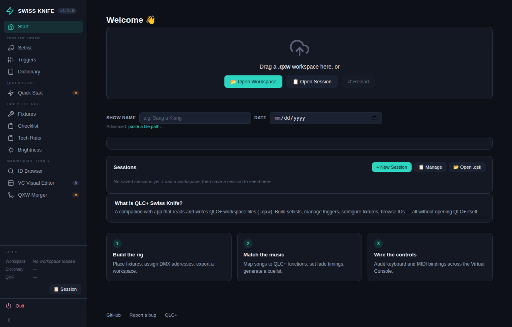
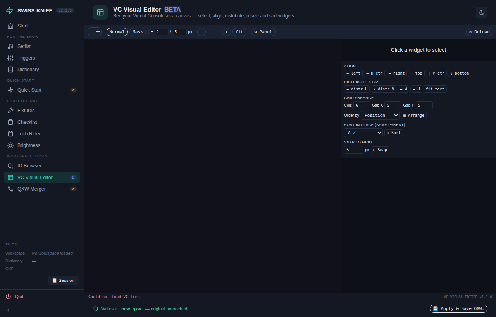
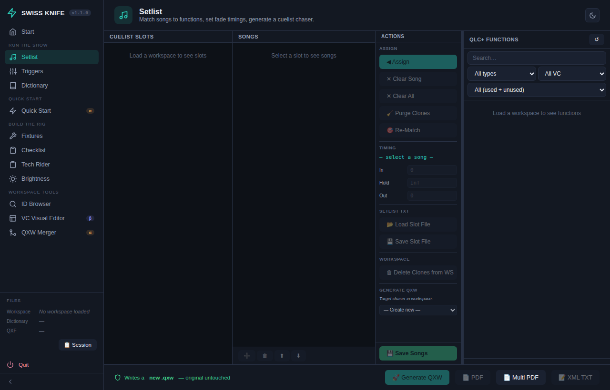
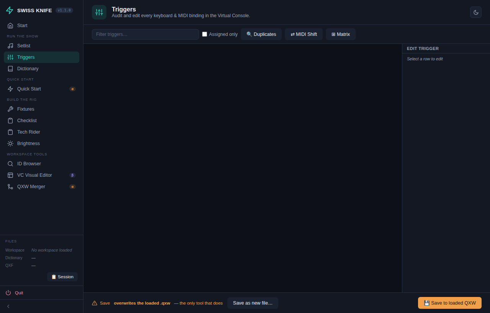
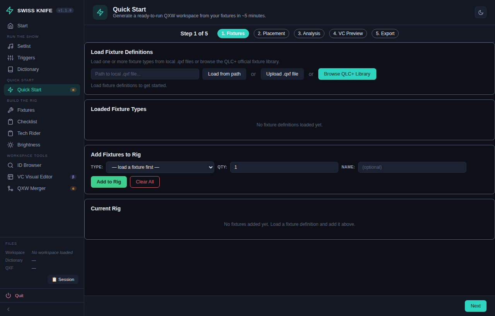
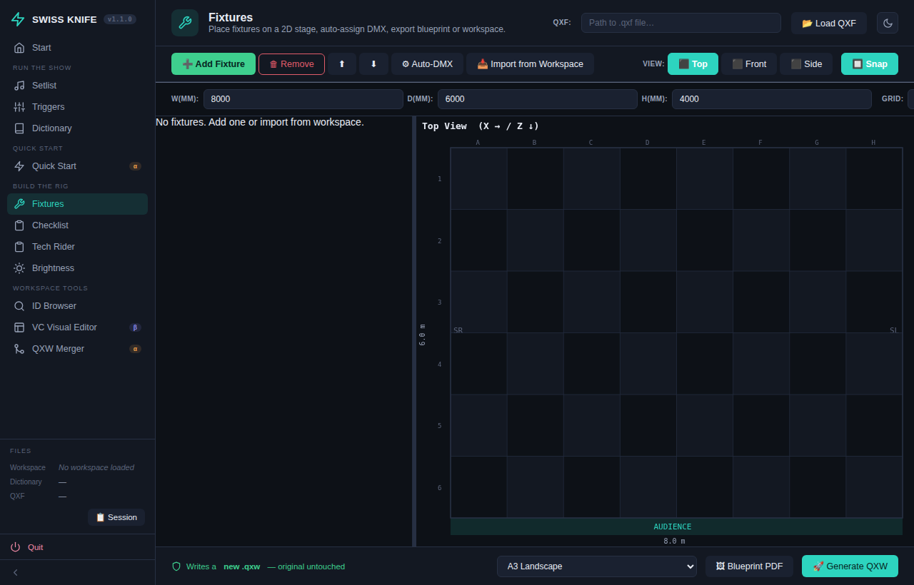
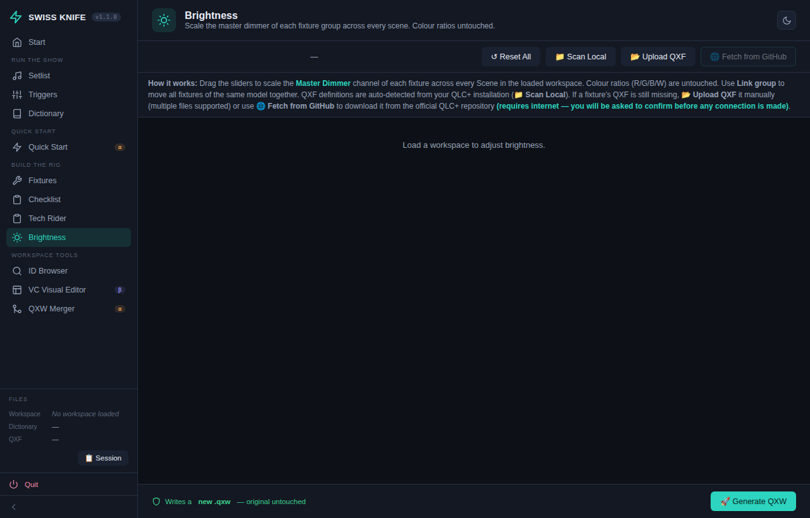
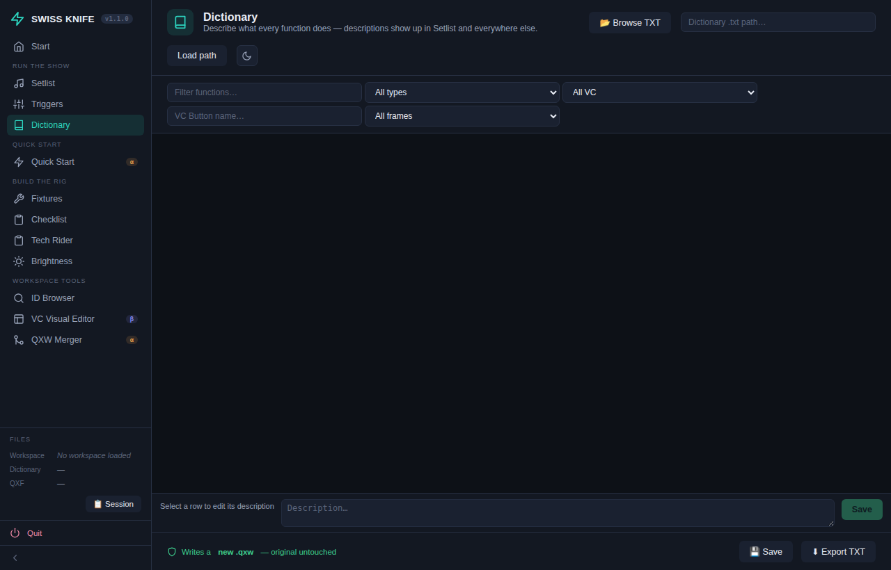
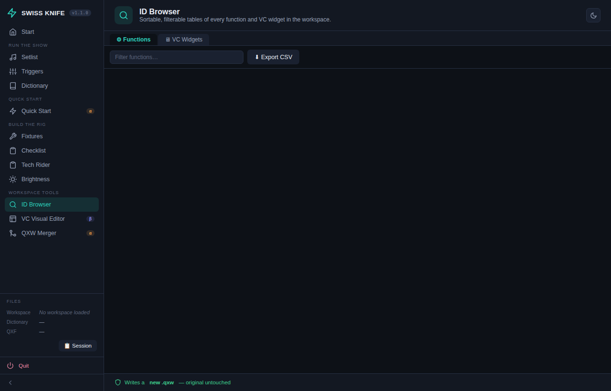

# ⚡ QLC+ Swiss Knife — v1.9.0

[](https://github.com/giopas/qlc-plus-swiss-knife-tool-script/actions/workflows/tests.yml)

**A web-based toolkit for QLC+ 5.x — load your `.qxw` workspace in a browser (or a native window) and manage every aspect of your show from a clean, sidebar-driven interface.**

> ⚠️ **Independent Project Notice**
> This project is **not affiliated with, endorsed by, or officially connected to the QLC+ project or its development team** in any way. All credit for QLC+ itself goes to the [QLC+ team](https://www.qlcplus.org/). This is an independent community utility that works *on top of* QLC+ workspace files (`.qxw`).

---

## ⚗️ Early release — bugs expected

This tool is in active development. Some features may be incomplete, behave unexpectedly, or not yet work at all. **Please test it and report any issues on the [Issues page](https://github.com/giopas/qlc-plus-swiss-knife-tool-script/issues)** — every bug report helps.

**Your show files are safe to experiment with:**
Opening a `.qxw` makes a working copy — the **show in progress** — that every tool changes; **💾 Save as new file…** writes it as `<name>_v<N+1>.qxw` (e.g. `Show_v41.qxw` → `Show_v42.qxw`) with one report of every change. Your original `.qxw` is never overwritten, and every step can be undone before you save.

---

## What's new in v1.9.0

A usability release: one show, every tool, back and forth — and every screen laid out the same way.

- **The show in progress**: open a show once and use every tool on it, in any order. Each tool's main button is **✓ Apply to the show**; the header counts the changes and shows the Doctor; **🕘 History** (and *Changes* on the left) goes back to any step, with **↷ Redo**; orange dots mark the tools that changed it; **💾 Save as new file…** writes it all with one report.
- **Function Porter on the show in progress**, with the **QXW Merger folded in**: copy fixtures and groups from another show (free addresses, 3D positions, copies always play their own looks), then port functions and buttons onto them. Step 3 has a tick-box picker for the targets.
- **Show Paperwork**: the Show Book, Checklist and Tech Rider in one tool, with **presets by reader** — tech rider for the venue (never carries show internals), crew checklist for load-in, show book for you — combined in one PDF if you like, with a **stage plot**; A4, A3 or US Letter.
- **Guided routes**: *Adapt a show to a new venue* and *Get ready for the gig* put a strip of steps above the tools — any step, any order, ticked as you go.
- **Every screen the same**: what it does and a **?** to its wiki page at the top, the main action bottom right; tabs in Look Builder (*Looks · Chasers*) and Stage & Meshes (*Selection · Place · Add · Stage*); a Start screen that says what the app is for; one verb for new files (*💾 Save as new file…*); Quick Start can **open the new show** straight away; the ID Browser works offline.

## What's new in v1.8.1

- **Stage & Meshes**: fixtures join the placement tools — place a mesh exactly between two fixtures, a fixture right above a mesh, or move fixtures with the same buttons, drag and arrow keys.
- **Start screen and side menu by job**, with the same 1–6 groups in both: New show · Adapt a show · Create · Run the show · Check & fix · Document.

## What's new in v1.8.0

- **Stage & Meshes** — the 3D stage seen from above and from the front, with fixtures and meshes. Place meshes by what you see (centre, height above the floor) instead of QLC+'s raw numbers; **put them on the floor in one click**; place one or several at once — to the left / right / back / front / centre, on the floor or to the ceiling, lined up, spaced evenly across the stage, nudged with the arrow keys; drag, rotate, scale, add models from your folders; change the stage keeping the meshes in place. Saved as a new file.

## What's new in v1.7.0

- **VC Builder** in the VC Visual Editor, with a clearer right panel in three tabs (Selection · Add & wire · Pages) — add buttons, frames, sliders, labels and CueLists; **drag a function onto the canvas** to wire a widget or add a button; drag widgets to move them with grid snap; rename, reorder and delete pages; a **label panel** with your naming legend; **arrange buttons by name group**; **screen profiles** (MacBook, Full HD, tablet, iPad); **page templates** you can reuse in the next show; the **setlist CueList** in one click. All undoable, saved as a new file.

## What's new in v1.6.0

- **Look & Chaser Builder** — looks for your fixture groups from a palette (warm, cold, scenic or your own colours), every channel declared, on PARs and moving heads alike; chasers from a pattern — all-hit, left/right, chase, ping-pong, build-up, seeded random — timed in ms or **BPM + note length**, cut or fade; **song presets** you can save; a **simulated DMX preview** you can play; buttons on a new VC page if you want them. Into a new file, Doctor-checked.

## What's new in v1.5.0

- **Workspace Doctor tab** — check the open show and **fix what you tick** into a new file: broken references, scenes that don't set every channel, strobe left on, a scene shared by a button and a chaser, widgets off the page, and a **PANIC RESET that can't reset** (a plain scene can't darken a look that is still running — the fix makes it a script that stops everything first). A fix report is saved next to the new file.
- **Rig Reducer** — keep the fixtures of a smaller rig; their values, groups, empty functions, buttons and faders are cleaned up; re-patch names and addresses; preview first, then save as a new file.
- New Doctor checks: PANIC RESET scene, setlist page not first, widget outside its page, 0 ms chaser steps, CueList with an empty chaser.

## What's new in v1.4.1

Fixes from the first real-show test: in the Function Porter, **Source wins** and the MIDI universe mapping now really apply (in v1.4.0 the app ignored them); step 4 warns before export which key/MIDI bindings clash with the target; a ported page keeps its layout instead of spilling onto a second page.

## What's new in v1.4.0

Phase 1 of the [work plan](WORKPLAN.md): **Quick Start, Function Porter and Show Book leave Alpha.** Build the next show with the tool — every output is checked by Workspace Doctor, tested on real show files and identical run to run.

- **Workspace Doctor** (`python -m core.doctor show.qxw`): read-only checks for duplicate IDs, dangling references, LTP bleed, strobe/program channels left on, missing PANIC RESET and more. It gates every export of Quick Start and Function Porter.
- **Quick Start**: mode-aware channels and safe neutral values, a PANIC RESET that really resets (tested in QLC+ 5.2.2), fixture groups with their own frame and dimmer, one-button-at-a-time looks, naming profiles and VC style cloned from any show.
- **Function Porter**: port looks, chasers and effects **with their Virtual Console buttons and frames** into another rig — even a smaller one (**fan-in**, e.g. 14 → 6 fixtures). Pick frames straight from the source VC, see both rigs on **stage plans**, untick fixtures you don't need, remove old pages/buttons from the result, and get a **port report** next to the new file. Output is checked by Doctor and is byte-identical run to run.
- **Start a new rig from an existing show**: build the rig in Quick Start, then **➜ Port from an existing show**. The rig can use **other fixture types** — looks are translated by capability (intensity, RGB mixing ↔ colour wheel, pan/tilt angles, strobe, gobo), not copied by channel number.
- **MIDI / key control comes along**: ported buttons and CueLists keep their controller bindings, the controller's input patch (device + input profile) is copied into the new file, bindings can move to another universe, and *Source wins* moves a binding off the widget that used it in the target.
- **Show Book**: the Virtual Console page by page with every frame, widget, position and **key/MIDI binding**; an optional **Doctor summary**; Shows and Scripts in the PDF/CSV; cleaner PDF.
- **Live QLC+ check** (`tools/qlc_check.py`): opens a file in a real QLC+ and presses every button to prove it works.

## What's new in v1.3.2

A "clean the bench" release — first step of the new [work plan](WORKPLAN.md) towards a deterministic show-file builder.

- **Your original file is never overwritten.** Trigger Manager now saves `<name>_v<N+1>.qxw` next to the loaded file (it used to overwrite it and drop the `<!DOCTYPE Workspace>` line). Every tool now writes through one safe writer and suggests the same `_v<N+1>` names.
- **QXW Merger and Function Porter work on real QLC+ files again** — they were seeing 0 fixtures / 0 functions in any workspace saved by QLC+.
- **Quick Start aims fixtures at the stage**: truss 45° from vertical, floor 45° uplight, mid-height horizontal, tilted toward the centre of the stage.
- **Brightness → Fetch missing QXFs from GitHub** works again.
- **VC Visual Editor: copy and move across pages.** Copy or move buttons and whole frames to another page or frame, duplicate a page, or start a new empty page. Plus pinch/⌘-scroll zoom, box-select from anywhere and ⌘-click multi-select.
- **Function Porter**, **VC Visual Editor** clicks and **Brightness** loading fixed; the Triggers tab is now called **Trigger Manager**.
- Tests consolidated, all green, and run on GitHub Actions for every push.

---

## What's new in v1.3.1

### UI — persistent metrics strip & status bar

- **Global metrics strip**: a persistent bar above every tool now shows the loaded workspace name and live Fixture / Function / VC Widget counts — no more switching to Start to check what's loaded.
- **Docked status bar**: load/save/export feedback now lives in a persistent bar at the bottom of the window instead of a floating toast in the corner.
- **Tighter table rows**: reduced vertical padding on the Grid.js tables (Triggers, ID Browser, Dictionary) and the custom fixture/rig tables, for a denser, more "pro tool" feel.
- Pure UI/shell change — no new dependencies, no backend changes, no breaking changes to any existing tab.

---

## What's new in v1.3.0

### 📦 Function Porter *(Alpha)*

Import functions from any source workspace into your loaded workspace with full dependency resolution — nested Scenes, Chasers, Collections, and EFX are pulled in automatically. An interactive fixture remapping wizard handles mismatched rigs, mapping channels by QXF capability (Pan → Pan, Dimmer → Dimmer) rather than raw offset.

### 📖 Show Book *(Alpha)*

Export your entire workspace as structured show paperwork — **PDF** or **CSV (ZIP)** — with decoded DMX values. Ten configurable sections cover everything from patch lists and function indexes to scene breakdowns with human-readable channel labels (e.g. "Gobo 3", "Strobe Slow→Fast @ 60%"). Generate a live preview in-app before exporting.

---

## Screenshots

| | | |
|---|---|---|
|  |  |  |
| Start Screen | Workspace Doctor | Function Porter |
|  |  |  |
| Look Builder | Stage & Meshes | VC Visual Editor |
|  |  |  |
| Setlist Manager | Trigger Manager | Show Paperwork |
|  |  |  |
| Quick Start | Fixtures | Brightness |
|  |  | |
| Dictionary | ID Browser | |

---

## Features

The tools are grouped by job, numbered 1–6 in the side menu and on the Start screen: **1 New show** (Quick Start, Fixtures) · **2 Adapt a show** (Rig Reducer, Function Porter — with the old QXW Merger —, Brightness) · **3 Create** (Look Builder, VC Visual Editor, Stage & Meshes) · **4 Run the show** (Setlist, Trigger Manager, Dictionary) · **5 Check & fix** (Workspace Doctor, ID Browser) · **6 Document** (Show Paperwork: tech rider, crew checklist, show book).

### Setlist Manager
Build complete show cue lists from a plain-text setlist. The **multi-slot architecture** gives each QLC+ CueList its own tab. Map songs to QLC+ functions with a four-stage fuzzy matcher (exact → substring → token → fuzzy), generate pristine cloned cue sequences, and export per-slot **PDFs** — all without touching the XML by hand.

The **function pool panel** shows usage counts, ✦ marks for already-generated clones, Used/Unused filtering, inline descriptions, and a refresh button to pull the latest descriptions from the Dictionary. Assigned songs display the matched function name, its VC button caption, and its description inline.

### Trigger Manager
Audit and edit all **Virtual Console keyboard and MIDI bindings** in a spreadsheet-style table. Resolves nested VC frame ancestry so the Frame filter works at any nesting depth. Spot conflicts, fix missing assignments, and save the result as a new version of the workspace (`_v<N+1>.qxw`). Additional tools: **Duplicates** highlights conflicting rows inline; **MIDI Shift** bulk-reassigns all triggers from one MIDI address to another; **Matrix** toggles an assignment grid showing every widget vs. every key, with duplicate keys flagged.

### Dictionary
Create and maintain `ID → description` mapping files that annotate your QLC+ function pool with human-readable labels. Load/save `.txt` dictionaries, edit descriptions inline, and filter by function type, VC button presence, **VC button name**, and **VC frame** (dropdown auto-populated from all frames in the workspace, with nested ancestry support).

### Fixtures
Design your stage rig from scratch. Load `.qxf` fixture definitions, add instances to a rig table, and **drag them on a 2D top-down canvas**. Configure stage dimensions, auto-assign DMX addresses, then generate a ready-to-use workspace with all fixture blocks and 3D monitor positions populated from your canvas layout. Export **blueprint PDFs** in multiple paper sizes.

### Quick Start QXW Generator
Create production-ready QLC+ workspaces in minutes, even with zero QLC+ experience. A 5-step wizard walks you through fixture selection, stage placement, automatic capability analysis, and intelligent VC layout generation. The system detects RGB, strobe, pan/tilt, and dimmer channels, groups fixtures by type, and auto-generates macro buttons (ALL ON/OFF, BLACKOUT), fixture group selectors, pre-configured scenes (Warm White, Cold White, Colors), skeleton effect chasers (Dimmer Sweep, Color Fade, Strobe), and four custom slots ready for your own scenes. Export a complete, wired `.qxw` file and open it in QLC+ — time to running show: ~5 minutes. Scenes follow each fixture's **selected mode** and leave unused channels at safe **neutral values** (shutter open, no effects, Pan/Tilt centred); every workspace gets a **PANIC RESET** button. Define **fixture groups** (each gets its own frame with a dimmer, looks and effects); all buttons sit in one solo frame, so pressing one switches the previous one off. The fixture `.qxf` files are saved next to the workspace so QLC+ always finds them. Pick a **naming profile** (plain, or the TheBand two-letter prefix `AS · Red`) and a **VC style** — built-in, or cloned from any reference `.qxw` (button size, gaps, fonts, page size). Workspace Doctor checks the result before it is saved. See the [Quick Start wiki page](https://github.com/giopas/qlc-plus-swiss-knife-tool-script/wiki/Quick-Start).

> **Internet access note:** The "Browse QLC+ Library" button in Step 1 fetches fixture definitions from the [official QLC+ fixture repository on GitHub](https://github.com/mcallegari/qlcplus/tree/master/resources/fixtures). This is the **only feature** in the app that makes external network calls. All other operations — loading, editing, exporting — are fully local with no internet required. If you prefer to stay offline, load fixture definitions from local `.qxf` files instead.

### Function Porter
Port looks, chasers and effects from one show (**source**) into another rig (**target**) — with their **Virtual Console buttons and frames** — in five steps:
1. **Load** both files; each rig is drawn from above (stage plan).
2. **Select** pages, frames or buttons of the source VC (ticking a frame ticks everything inside) and/or single functions; everything they need (chaser steps, collection members, matrix groups) is added automatically.
3. **Map** source fixtures to target fixtures: every exact match, same fixture ID (a reduced rig) or **fan-in by stage position** (14 → 6: each target takes the first *lit* source of its block, so chases still move and colours never mix). The stage plans are coloured by the mapping; hover a row to see the fixture; untick **Port this fixture** for what you don't need.
4. **Validate**: warnings and summary; choose where the widgets go (a new page by default), the key/MIDI binding policy, and optionally **remove existing pages/buttons** from the result.
5. **Apply** to the show in progress (one step in its History, undoable) — or *Export a copy…* as a new `<target>_v<N+1>.qxw` with a **port report**. Doctor checks it first; the source file is never changed.

Step 2 can also **copy fixtures and fixture groups** from the source (what the QXW Merger did): free addresses are checked, 3D positions come along, and the ported functions play on the copies.

Ported scenes declare every channel (neutral values for the missing ones), new IDs are allocated deterministically, a Quick Start PANIC RESET in the target also stops the ported functions, and Level sliders start at 0. The target can use **different fixture types**: values are translated by capability (dimmer, RGB mixing ↔ colour wheel, pan/tilt angles, strobe, gobo), and Sequences and EFX follow. **Key / MIDI bindings** come along with the controller's input patch; choose the target universe, and *Source wins* moves a binding the target already used. From Quick Start, **➜ Port from an existing show** opens the Porter with the new rig as the target. See the [Function Porter wiki page](https://github.com/giopas/qlc-plus-swiss-knife-tool-script/wiki/Function-Porter).

### Show Paperwork
The paper for each reader, from the show in progress, in one tool. **Presets**: 🎟 *Tech rider* for the venue (fixture types and counts, patch, stage plot — and, by rule, never function names, key/MIDI maps, the VC or the Doctor), ✅ *Crew checklist* for load-in (tick boxes, patch, 3D positions, stage plot), 📖 *Show book* for you at the desk (summary, patch, every function with decoded DMX values, VC layout page by page with key/MIDI bindings, Doctor summary), ⚙ *Custom*. ⇧-click combines presets in one PDF (e.g. rider + checklist for a festival advance). Sections grouped as *The rig · The show · Console & checks*; **PDF** in A4, A3 or US Letter, landscape or portrait, or **CSV** (ZIP). See the [Show Paperwork wiki page](https://github.com/giopas/qlc-plus-swiss-knife-tool-script/wiki/Show-Paperwork).

### Workspace Doctor
Read-only health check of any `.qxw`: duplicate IDs, dangling references, LTP bleed, strobe/program channels left on, shared latch scenes, missing PANIC RESET, dead MIDI inputs, unused functions and more (codes D001–D016). It runs before every Quick Start and Function Porter export — errors block, warnings are reported — and from the command line: `python -m core.doctor show.qxw` (`--json`, `--all`). The **Workspace Doctor tab** fixes what you tick — broken references, incomplete scenes, strobe left on, shared scenes, a PANIC RESET that can't reset, widgets off the page — in the **show in progress**, with a fix report (`--fix` on the command line). See the [Workspace Doctor wiki page](https://github.com/giopas/qlc-plus-swiss-knife-tool-script/wiki/Workspace-Doctor).

### Rig Reducer
Turn a big show into one for a smaller rig: untick the fixtures you won't have, re-patch the rest (name, universe, address), **Preview**, then **✓ Apply to the show**. Scene values, groups, EFX/matrix fixtures, 3D positions, functions left empty, their buttons and faders are cleaned up; the Workspace Doctor checks the result. See the [Rig Reducer wiki page](https://github.com/giopas/qlc-plus-swiss-knife-tool-script/wiki/Rig-Reducer).

### Look & Chaser Builder
Build looks and chasers straight into the open show. **Looks**: tick fixture groups and palette colours → one scene per group × colour; the colour is set by capability (RGB/RGBW mixing, colour wheel or dimmer) and every channel is declared. **Chasers**: pick a group, a pattern (all-hit, left/right, chase, ping-pong, build-up, seeded random), colours, timing (ms, or BPM + note length) and cut or fade; the preview shows each fixture's colour per step and plays it. Save a chaser as a **song preset** and reuse it. Looks and chasers are two tabs; optional VC page with coloured buttons; names follow your naming profile; the Workspace Doctor checks the result, which is added to the show in progress. See the [Look Builder wiki page](https://github.com/giopas/qlc-plus-swiss-knife-tool-script/wiki/Look-Builder).

### Stage & Meshes
Place the 3D meshes of your show — band members, risers, drum kit, truss — by what you see: centre on the stage and height above the floor. The list shows which models float or sink; one click puts them on the floor, exactly. Select one or several models — and fixtures — and push them to a stage edge, the centre, the floor or the ceiling; line them up; space them evenly between two or across the whole stage; nudge them with buttons or the arrow keys; place meshes relative to fixtures (e.g. between two of them) or fixtures relative to meshes. Plan and front views (drag to move, several at once), rotation and scale that keep the model in place, add models from your mesh folders, change the stage type and size. See the [Stage and Meshes wiki page](https://github.com/giopas/qlc-plus-swiss-knife-tool-script/wiki/Stage-and-Meshes).

### Brightness
Adjust the relative brightness of any fixture type across an entire show file without rebuilding anything. Use the per-model sliders to set a scale factor (0–200%), then **✓ Apply to the show**. The Master Dimmer channel is detected automatically from QXF fixture definitions; if a QXF is not found, you can type the offset manually, upload the file, or fetch it from the QLC+ GitHub repository. Colour channel values are never touched — only the dimmer.

### ID Browser
Inspect every function and Virtual Console widget in sortable, filterable tables (plain tables when offline). Live filtering, click-to-sort column headers, and **Export CSV** for both the Functions and VC Widgets sub-tabs.

### VC Visual Editor
See your Virtual Console as a canvas — **build it** and tidy it. **Build**: add buttons, frames, sliders, labels and CueLists; wire them to functions from a list filtered by your naming groups, or **drag a function onto the canvas**; delete and duplicate; rename, reorder and delete pages; label panels (your naming legend); arrange a frame's buttons by name group; screen profiles (MacBook 1650 × 884, Full HD, tablet, iPad); page templates reusable in other shows; one-click setlist CueList. **Tidy**: drag selected widgets with grid snap, select, align, distribute, resize, and sort widgets visually. **Copy or move** buttons and frames to another page or frame, **duplicate a page**, or add a new one. Pinch or ⌘-scroll to zoom, drag a box or ⌘-click to multi-select. Quick-action buttons handle alignment, equal distribution, same-size, fit-to-text, grid arrange with configurable columns/gaps and sort order, sort-in-place for siblings, and snap-to-grid. **Alignment mask** mode colour-codes every widget by how far it deviates from its neighbours.

### QXW Merger → part of the Function Porter (1.9)
Copying fixtures, fixture groups and functions from another workspace is now step 2 of the **Function Porter** (*Fixtures and groups to copy into the target*), with free-address checks, groups rebuilt on the copies, the Doctor check and undo.

---

## Requirements

| Requirement | Details |
|---|---|
| Python | 3.8 or newer |
| Flask | `pip install flask` — the only required dependency |
| pywebview | `pip install pywebview` — *optional*, enables native window mode |
| Browser | Chrome or Edge recommended (for native Save dialog); Firefox/Safari also work |
| QLC+ workspace | `.qxw` format (QLC+ 5.x) |

---

## Quick Start

### macOS / Linux — first time only

```bash
git clone https://github.com/giopas/qlc-plus-swiss-knife-tool-script.git
cd qlc-plus-swiss-knife-tool-script
python3 -m venv ~/.venvs/swissknife
source ~/.venvs/swissknife/bin/activate
python -m pip install -r requirements.txt   # flask + pywebview (native window)
python app.py
```

> **macOS: keep the virtual environment outside iCloud.** If the project lives in an iCloud-synced folder (Documents, Desktop), a `.venv` inside it gets "file 2.js" duplicates and the native window crashes with `KeyError: 'text_select'`. That's why the commands above put it in `~/.venvs/swissknife`; `run.sh` and the macOS app launcher use that location automatically.

### macOS / Linux — every subsequent run

```bash
cd qlc-plus-swiss-knife-tool-script
python3 app.py              # native window (if pywebview is installed)
python3 app.py --browser    # force browser mode
```

> `bash run.sh` finds the virtual environment automatically (`~/.venvs/swissknife`, or `.venv` in the project) — no need to activate it manually.
>
> **Tip:** if `pip` is not found, use `pip3` instead — or skip the `source .venv/bin/activate` step and call the venv pip directly:
> ```bash
> .venv/bin/pip install flask
> .venv/bin/pip install pywebview
> ```

---

### Windows (Command Prompt) — first time only

```bat
git clone https://github.com/giopas/qlc-plus-swiss-knife-tool-script.git
cd qlc-plus-swiss-knife-tool-script
python -m venv .venv
.venv\Scripts\activate.bat
pip install flask
pip install pywebview
python app.py
```

> `pywebview` is optional — it opens the app in a native window instead of a browser tab. Skip it if you prefer browser mode.

### Windows (Command Prompt) — every subsequent run

```bat
cd qlc-plus-swiss-knife-tool-script
python app.py
python app.py --browser
```

> The first command opens a native window (if pywebview is installed). Use `--browser` to force browser mode instead.

---

The app opens `http://localhost:5731` automatically. Press **Ctrl+C** or use the **Quit** button in the sidebar to quit.

> **Native window mode:** install `pywebview` for a standalone-app experience:
> ```bash
> .venv/bin/pip install pywebview    # macOS / Linux
> .venv\Scripts\pip install pywebview  # Windows
> ```
> Use `python3 app.py --browser` to force browser mode.
>
> **Platform launchers:** see the `launchers/` directory for macOS `.app`, Windows `.bat`, and Linux `.desktop` files.

### Loading a workspace

- **Start screen** — drag a `.qxw` file anywhere onto the window, or use the **Open Workspace** / **Open Session** buttons.
- **📂 Open…** in the header, from any tool. In a plain browser without a native file dialog, paste the full path in the Start screen's path field and click **Load**.
- **Recent files** — previously opened workspaces appear in the Start screen's recents panel.

---

## Supported Platforms

| Platform | Status |
|---|---|
| Windows 10/11 | ✅ Tested |
| macOS 12+ | ✅ Tested |
| Linux (Ubuntu / Debian) | ✅ Tested |

---

## Security

The app binds **only to `127.0.0.1`** (localhost) and is not accessible from other machines on your network. Additional hardening:

- All state-changing API requests are validated against a localhost Origin header (CSRF protection).
- File uploads are restricted to `.qxw` extension for workspaces and `.qxf` for fixture definitions; filenames are sanitised with `werkzeug.utils.secure_filename` before saving. XML payloads are size-capped before parsing.
- `Content-Security-Policy`, `X-Frame-Options`, `X-Content-Type-Options`, and `Referrer-Policy` headers are set on every response.
- Exception messages sent to the browser have filesystem paths stripped.
- The `Content-Disposition` filename value is sanitised (non-alphanumeric characters stripped) and properly quoted.

### Network access

The app is fully local **except** for the "Browse QLC+ Library" button in the Quick Start and Brightness tools, which fetches fixture data from `api.github.com` and `raw.githubusercontent.com` (the official QLC+ repository). No authentication tokens are sent and no user data leaves the machine. All other features work entirely offline.

---

## Project Structure

```
app.py                   ← Flask entry point (auto-bootstraps venv)
core/
  workspace.py           ← QXW parser, function pool, setlist engine
  merger.py              ← Independent two-file merger
  brightness.py          ← Per-fixture dimmer scaling
  fixture.py             ← Rig state, QXF parsing, DMX auto-assign
  pdf.py                 ← Pure-Python PDF builder (no reportlab)
  porter.py              ← Function Porter: dependency resolver, fixture remapper, fan-in, Doctor gate, report
  porter_vc.py           ← Function Porter: VC widget porting (pruning, IDs, placement, removal)
  porter_input.py        ← Function Porter: input patch, key/MIDI bindings, universe remap
  capability_map.py      ← Capability translation between fixture types
  doctor/                ← Workspace Doctor: checks, fixes (fixes.py) + CLI (python -m core.doctor)
  rig_reducer.py         ← Rig Reducer: remove fixtures with cascade, re-patch, Doctor diff
  vc_ops.py              ← VC edits: copy/move widgets, pages
  vc_builder.py          ← VC Builder: create/wire widgets, pages, label panels, screens, templates
  stage3d.py             ← Stage & Meshes: mesh placement, on the floor, OBJ bounds, mesh library
  look_builder.py        ← Look & Chaser Builder: palette looks, pattern chasers, presets, preview
  looks/                 ← built-in palettes and song presets (JSON)
  quick_start/           ← Quick Start: channel model, VC generator, profiles, QXW builder
  qxw_io.py              ← the one safe QXW reader/writer (never overwrites)
  showbook.py            ← Show Book: document generator, PDF/CSV exporter
  qxf_parser.py          ← Deep QXF channel parser, DMX value decoder
routes/
  workspace_routes.py    ← /api/load, /api/status, /api/reload
  setlist_routes.py      ← /api/setlist/*
  merger_routes.py       ← /api/merger/*
  brightness_routes.py   ← /api/brightness/*
  dictionary_routes.py   ← /api/dictionary/*
  checklist_routes.py    ← /api/checklist/*
  triggers_routes.py     ← /api/triggers/*
  fixture_routes.py      ← /api/fixture/*
  porter_routes.py       ← /api/porter/*
  showbook_routes.py     ← /api/showbook/*
  doctor_routes.py       ← /api/doctor/*
  reducer_routes.py      ← /api/reducer/*
  looks_routes.py        ← /api/looks/*
  stage_routes.py        ← /api/stage/*
  id_browser_routes.py   ← /api/functions, /api/vc-widgets
  session_routes.py      ← /api/session/*
  picker_routes.py       ← /api/picker/* (native OS file picker)
static/
  css/tokens.css         ← Design tokens (3 themes via data-theme)
  css/style.css          ← Sidebar layout and component styles
  icons.svg              ← SVG symbol sprite (Lucide-style)
  js/                    ← Per-tool JavaScript modules
templates/index.html     ← Single-page application shell
launchers/               ← Platform-specific launchers (macOS .app, Windows .bat, Linux .desktop)
screenshots/             ← Screen captures of all 14 tools
```

---

## Changelog

See [CHANGELOG.md](CHANGELOG.md) for a full history of changes across all versions.

---

## Contributing

Bug reports, feature suggestions, and pull requests are warmly welcome!
Please read [CONTRIBUTING.md](CONTRIBUTING.md) before opening an issue or submitting code.

---

## Roadmap

See [ROADMAP.md](ROADMAP.md) for planned features and future directions.

---

## License

This project is released under the **MIT License** — see [LICENSE](LICENSE) for the full text.
In short: free to use, modify, and distribute. Attribution appreciated. No warranties provided.

---

## Support QLC+

**This tool would not exist without QLC+.** If you find the Swiss Knife useful, it means QLC+ is useful to you too — and QLC+ is built and maintained by a tiny team of volunteers who give their time for free.

**Please consider donating to the QLC+ project.** Even a small contribution helps keep QLC+ alive, fund development of new features, and ensure this incredible open-source lighting software remains available for everyone — from bedroom DJs to professional stage crews.

👉 **[Donate to QLC+ on GitHub](https://github.com/mcallegari/qlcplus)** — look for the **Sponsor** button on the repository page.

Every euro, dollar, or coffee counts. If QLC+ has ever saved you time, money, or a gig — give something back. The developers deserve it.

---

## Acknowledgements

All credit for **QLC+** — the lighting control software this tool is built around — belongs to the [QLC+ development team](https://github.com/mcallegari/qlcplus). This script is an independent community contribution and is not part of the official QLC+ project.
